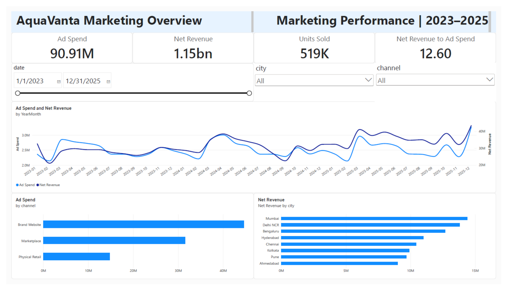
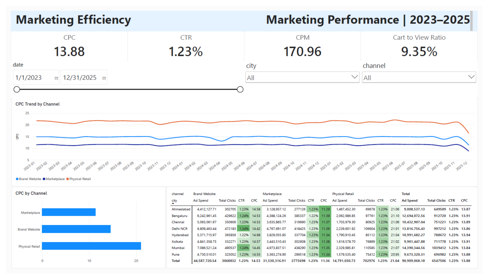
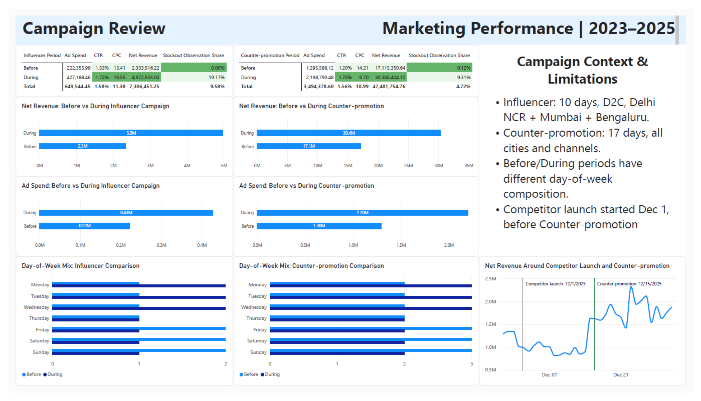

# AquaVanta Marketing Analysis
Power BI marketing performance analysis with campaign, channel, city, and efficiency insights.

## Overview

This project analyzes marketing performance for AquaVanta, a synthetic consumer product business operating across multiple Indian cities and sales channels.

The analysis was built in Microsoft Power BI and focuses on marketing spend, digital engagement, sales performance, stock availability, and campaign-level comparisons.

The objective is to understand how marketing investment and observed business outcomes vary by city, sales channel, campaign type, and time period, and to identify patterns that can support future marketing budget decisions.

The project follows an end-to-end analytics workflow including data validation, Power Query transformation, data modeling, DAX measure development, dashboard creation, campaign analysis, and business interpretation.

## Business Questions

The analysis was designed to answer the following business questions:

- How do marketing spend and performance differ across cities and sales channels?
- Which channels deliver the most efficient traffic based on CTR, CPC, CPM, and cart conversion behavior?
- How do marketing investment and net revenue change over time?
- What patterns are observed before and during the Influencer campaign?
- What patterns are observed before and during the Counter-promotion campaign?
- How do stock availability and external events affect the interpretation of campaign performance?
- Which findings can support future marketing budget tests and channel-level decisions?

## Dataset

The project uses a synthetic multi-table dataset covering the period from January 2023 to December 2025 across 8 Indian cities and 3 sales channels.

The main source files include:

- `marketing_daily.csv` — daily marketing spend and engagement metrics by date, city, channel, and campaign type.
- `sales_daily.csv` — daily sales performance at date, city, channel, and SKU level.
- `inventory_daily.csv` — inventory and stockout information at date, city, channel, and SKU level.
- `market_events.csv` — dated marketing, pricing, operational, and competitive events used for campaign context.
- `weather_calendar.csv` — weather and calendar data available for contextual analysis.
- `returns_reviews.csv` — returns and review-related data.
- `model_ready_daily.csv` — prepared reference dataset used only as a validation/reference source.

The core analytical model was built from the raw marketing, sales, and inventory tables rather than from `model_ready_daily.csv`.

## Tools

- Microsoft Power BI — dashboard development, data modeling, DAX measures, and interactive analysis.
- Power Query — data import, cleaning, validation, transformation, aggregation, and source parameterization.
- DAX (Data Analysis Expressions) — calculated measures and analytical logic used in the Power BI model.
- CSV (Comma-Separated Values) files — raw source data used across the project.
- GitHub — project documentation and portfolio presentation.

## Data Preparation

The raw source data was validated and transformed in Power Query before being loaded into the analytical model.

Key preparation steps included:

- Verified data types and checked for null values and transformation errors.
- Validated marketing totals between `marketing_daily.csv` and the marketing fields embedded in `sales_daily.csv`.
- Confirmed that `gross_revenue - return_value = net_revenue` within the defined tolerance.
- Checked for duplicate records using the expected business keys for marketing, sales, and inventory tables.
- Aggregated sales data from SKU level to date × city × channel level.
- Aggregated inventory data to calculate stockout-related metrics at date × city × channel level.
- Merged the prepared marketing, sales, and inventory tables into the final `FactPerformance` table.
- Created dimension tables for date, city, channel, and campaign type.
- Added a `SourceFolder` Power Query parameter so source file paths can be updated centrally without editing every query individually.

## Data Model

The Power BI model follows a star-schema structure centered on the `FactPerformance` table.

The fact table has a grain of one row per date × city × sales channel and combines marketing, sales, and inventory performance.

Dimension tables include:

- `DimDate` — calendar attributes used for time-based analysis.
- `DimCity` — city-level filtering and segmentation.
- `DimChannel` — sales channel filtering and comparison.
- `DimCampaignType` — campaign type classification.

All core relationships are active one-to-many relationships from the dimension tables to `FactPerformance`, using single-direction filtering.

This structure keeps the analytical model simple, reduces duplication, and supports consistent filtering across report pages.

## Measures

The report uses DAX (Data Analysis Expressions) measures to calculate marketing efficiency, engagement, sales performance, and stock availability metrics.

Key measures include:

- `Ad Spend` — total marketing spend.
- `Total Impressions` — total number of ad impressions.
- `Total Clicks` — total number of ad clicks.
- `CTR (Click-Through Rate)` — share of impressions that resulted in clicks.
- `CPC (Cost per Click)` — marketing spend divided by total clicks.
- `CPM (Cost per Mille)` — marketing spend per 1,000 impressions.
- `Total Product Page Views` — total product page views.
- `Total Add to Cart` — total add-to-cart actions.
- `Cart to View Ratio` — share of product page views that resulted in an add-to-cart action.
- `Spend per Cart Addition` — marketing spend per add-to-cart action.
- `Units Sold` — total units sold.
- `Gross Revenue` — revenue before returns.
- `Return Value` — total value of returned products.
- `Net Revenue` — revenue after returns.
- `Net Revenue to Ad Spend` — net revenue divided by marketing spend.
- `Stockout Observation Share` — share of SKU observations with a stockout condition.

Measures were validated against the source data for the full analysis period and multiple filtered slices to confirm calculation accuracy.

## Dashboard

The final Power BI report contains three analytical pages designed to move from high-level performance monitoring to channel efficiency and campaign-level review.

### Overview



The Overview page summarizes overall marketing and commercial performance across the full analysis period.

It includes:

- Ad Spend
- Net Revenue
- Units Sold
- Net Revenue to Ad Spend
- Monthly trends for Ad Spend and Net Revenue
- Ad Spend by sales channel
- Net Revenue by city
- Interactive filters for date, city, and channel

### Marketing Efficiency



The Marketing Efficiency page focuses on digital marketing efficiency and channel-level differences.

It includes:

- CPC
- CTR
- CPM
- Cart to View Ratio
- CPC trend by channel
- CPC comparison across sales channels
- City × channel matrix with Ad Spend, Total Clicks, CTR, and CPC
- Conditional formatting to highlight relative performance

### Campaign Review



The Campaign Review page compares observed performance before and during two marketing campaigns:

- Influencer campaign
- Counter-promotion campaign

The analysis includes:

- Before vs During comparisons for Ad Spend, CTR, CPC, Net Revenue, and Stockout Observation Share
- Net Revenue and Ad Spend comparisons
- Day-of-week composition checks
- Daily Net Revenue trend around the competitor product launch and Counter-promotion
- Explicit campaign context and analytical limitations

## Key Findings

- Marketplace consistently delivered the lowest CPC across most of the analysis period, while Physical Retail showed the highest CPC, indicating materially different traffic acquisition efficiency across channels.

- CTR remained relatively stable across cities, with only small differences, while CPC varied more substantially and therefore provided a more useful basis for channel-level efficiency comparison.

- During the Influencer campaign, Ad Spend increased from approximately 0.22M to 0.43M, while Net Revenue increased from approximately 2.33M to 4.97M. CTR improved and CPC declined, but Stockout Observation Share increased sharply from 0.00% to 19.17%.

- During the Counter-promotion period, Ad Spend increased from approximately 1.30M to 2.20M and Net Revenue increased from approximately 17.12M to 30.37M. CTR improved and CPC declined, while Stockout Observation Share increased from 0.12% to 9.31%.

- Both campaign comparisons showed stronger marketing and revenue metrics during the campaign periods, but stock availability became a significant constraint and may have limited additional sales.

- The Counter-promotion comparison is affected by an overlapping competitor product launch that began on December 1, 2025, before the Counter-promotion started on December 15, 2025.

- Before and During comparison periods have different day-of-week compositions, so observed changes should be interpreted as descriptive patterns rather than causal campaign effects.

## Limitations

- The dataset is synthetic and is intended for analytical and portfolio purposes rather than real-world operational decision-making.

- The analysis does not use purchase-level advertising attribution, so marketing spend cannot be directly tied to individual purchases.

- Metrics such as CAC (Customer Acquisition Cost), LTV (Customer Lifetime Value), and proven ROAS (Return on Ad Spend) cannot be reliably calculated from the available data.

- Campaign comparisons are descriptive rather than causal. Changes observed during campaign periods may also be influenced by calendar effects, stock availability, competitor activity, and other external events.

- The Before and During periods for both campaign analyses have different day-of-week compositions.

- The Counter-promotion period overlaps with a competitor product launch that began before the campaign, which complicates interpretation.

- Stockout Observation Share measures the proportion of SKU observations with stockout conditions; it does not directly estimate lost sales or stockout duration.

- Currency is not explicitly defined in the source data, so monetary metrics are presented without a currency symbol.

## Repository Contents

```text
aquavanta-marketing-analysis/
├── Raw_Data/
│   ├── marketing_daily.csv
│   ├── sales_daily.csv
│   ├── inventory_daily.csv
│   ├── market_events.csv
│   ├── weather_calendar.csv
│   ├── returns_reviews.csv
│   └── model_ready_daily.csv
│
├── Report/
│   └── AquaVanta_Marketing_Analysis.pbix
│
├── Screenshots/
│   ├── overview.png
│   ├── marketing_efficiency.png
│   └── campaign_review.png
│
└── README.md
```

## Conclusion

This project demonstrates an end-to-end Power BI marketing analytics workflow, from raw multi-table data preparation and validation to data modeling, DAX measure development, dashboard design, and campaign-level interpretation.

The analysis highlights meaningful differences in marketing efficiency across channels and shows how campaign-period performance should be evaluated together with revenue, stock availability, calendar effects, and external market events.

The project also emphasizes analytical discipline: observed changes are treated as descriptive evidence rather than proof of causal impact.

Overall, the report provides a structured framework for comparing marketing performance and identifying areas for future budget testing and operational follow-up.
